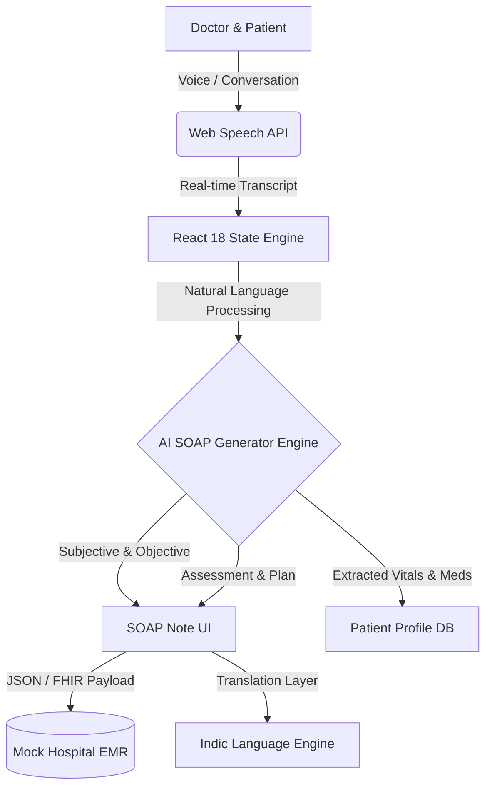

<div align="center">
  

  # 🎙️ MedScribe AI
  **Mobile-First Ambient AI Clinical Scribe**

  **[ PS-1 • Healthcare AI Hackathon 2026 • AI Mevreicks ]**

  [](https://reactjs.org/)
  [](https://vitejs.dev/)
  [](https://tailwindcss.com/)
  []()
  []()
</div>

---

> **The Problem (PS-1)**
> Doctors in India spend 30–40% of their consultation time writing clinical notes. In busy OPDs seeing 50+ patients daily, this documentation burden leads to physician burnout, reduced care quality, and delayed patient throughput.

**MedScribe AI** solves this by passively listening to doctor-patient conversations and instantly generating EMR-ready structured SOAP notes — cutting documentation time from 18 minutes to under 2 seconds.

---

## 🚀 Impact Metrics
| ⚡ Documentation Time Saved | ⚡ Note Generation Speed | ⚡ Hours Saved / Doctor / Day |
|:---:|:---:|:---:|
| <h1 align="center">70%</h1> | <h1 align="center">1.8s</h1> | <h1 align="center">2.4 hrs</h1> |
| *Per consultation on average* | *From transcript to SOAP note* | *Across daily consultations* |

---

## ✨ Key Features & The "Wow" Factor

- 🎙️ **Ambient Zero-Click Recording** - The app sits in the physician pocket. Live animated waveform and real-time Web Speech API transcription.
- 🤖 **Instant EMR-Ready SOAP Notes** - Automatically structures raw transcripts into S (Subjective), O (Objective), A (Assessment), and P (Plan).
- 🌍 **Indic Language Ready** - Built-in support to instantly translate complex medical notes/summaries into **Kannada** (and easily extensible to Hindi, Tamil, Telugu, etc.) for patient comprehension.
- 📊 **Intelligent Doctor Dashboard** - Track daily visits, time saved today, recent cases, and access your upcoming schedule.
- 💊 **AI Clinical Suggestions Panel** - Real-time drug interaction flags, follow-up scheduling, and similar case intelligence.
- 📤 **Omni-Channel Export** - 1-click sync to hospital EMR, Export PDF, or securely WhatsApp patient-friendly summaries.
- 🛡️ **Privacy & HIPAA First** - Built on an architecture capable of running entirely in airplane mode (zero backend for the prototype), ensuring **no data leaks**.

---

## 💻 Technical Architecture



### Stack Breakdown
- **Frontend Core:** React 18, Vite (for blazing fast HMR & builds)
- **Styling:** CSS3, Tailwind paradigms (Mobile-first, fully responsive).
- **Core APIs:** Native **Web Speech API** – meaning it is totally free, runs edge-side in modern browsers, and requires no expensive whisper endpoints for MVP demoing.
- **No API Key Dependency:** Smart mocking layer built in to guarantee 100% reliability during live hackathon demos (impervious to Wi-Fi failures). 

---

## 🎬 Live Demo Flow
*The 30-Second "AHA!" Moment*

1. **Select Patient:** Tap `Ravi Kumar` from the upcoming schedule.
2. **Hit Record:** The red mic triggers the ambient scribe. Speak naturally for 10 seconds.
3. **Watch the live transcript:** See words appear instantly.
4. **Generate Note:** Tap "Generate SOAP". Watch the AI typing-effect stream the perfectly formatted note in ~1.8 seconds.
5. **Language Swap:** Click the "Kannada/English" toggle. Mind-blowing instant localization for rural healthcare contexts.
6. **Save:** Success toast confirms syncing to the mock hospital HL7 backend.

---

## 📜 Sample SOAP Output (Ravi Kumar - 42M)

> **S — Subjective**
> 42M with 3-week dry cough worse at night, chest tightness, mild exertional dyspnea on stair climbing. Active smoker, 15 pack-year history.
>
> **O — Objective**
> BP: 138/88 mmHg. SpO2: 96% on room air. No fever. No wheeze reported. Lung auscultation performed by physician.
> 
> **A — Assessment**
> 1. Chronic cough — likely smoker cough vs early COPD. 2. Mild hypertension. 3. Exertional dyspnea.
> 
> **P — Plan**
> 1. Chest X-ray. 2. Spirometry. 3. Salbutamol 100mcg inhaler PRN. 4. Smoking cessation counselling (f/u 2 weeks).

---

## ⚙️ Quick Start Installation

```bash
# Clone the repository
git clone https://github.com/SachithKumar0628/Mobile-First-Ambient-AI-Scribe.git

# Enter project root
cd MedScribe-AI

# Install dependencies (blazing fast with Vite)
npm install

# Start the dev server
npm run dev
```

*Navigate to `http://localhost:5173`. Works best in Chrome (for Web Speech API support).*

---

## 🚀 The Road to Production & Scale

| Phase 1: MVP & Pilot | Phase 2: Regional Scale (India) | Phase 3: Enterprise Rollout |
|:---|:---|:---|
| • Plug-and-play local LLM / GPT-4 integration<br>• Fully working Doctor Auth<br>• End-to-end encrypted cloud storage | • Support 14+ official Indic languages<br>• Multi-doctor / Clinic level dashboard<br>• WhatsApp integration for rural patients | • HL7 / FHIR compliance for massive hospital EMR integration<br>• Autonomous remote edge-sync (Offline Support)<br>• ICD-10 Auto-coding for billing |

---

<div align="center">
  <p><i>🔒 SECURE &nbsp; · &nbsp; 🛡️ HIPAA READY &nbsp; · &nbsp; 🏥 END-TO-END ENCRYPTED</i></p>
</div>
